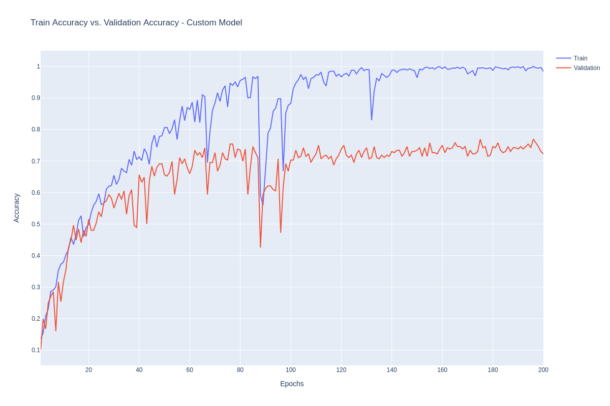
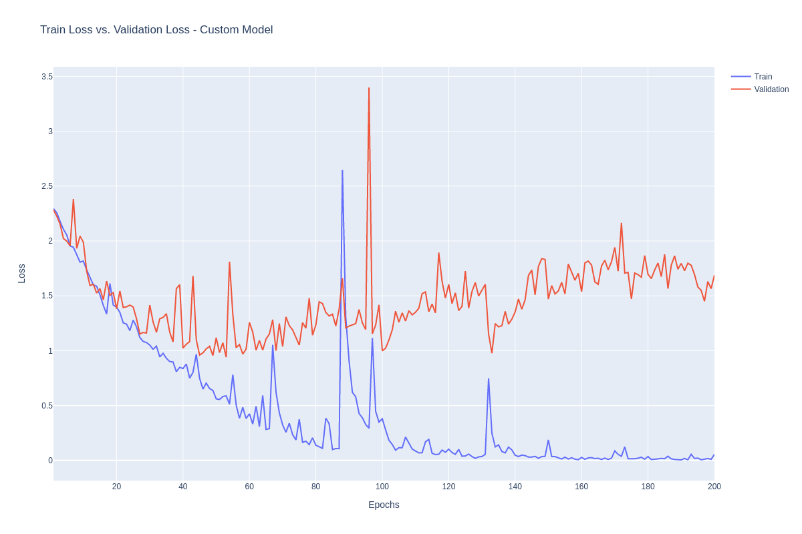
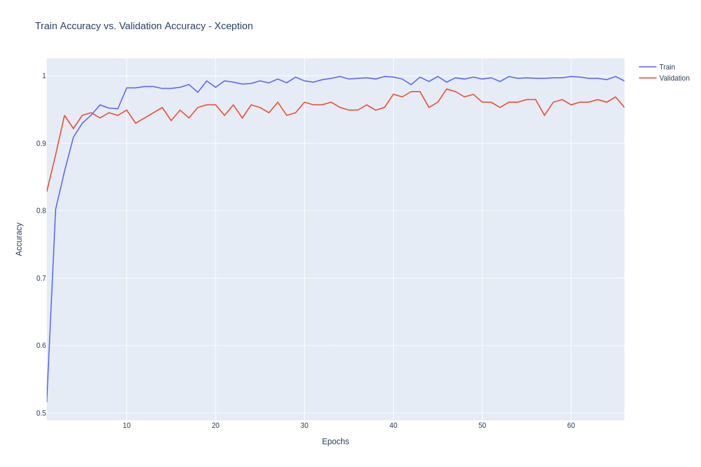
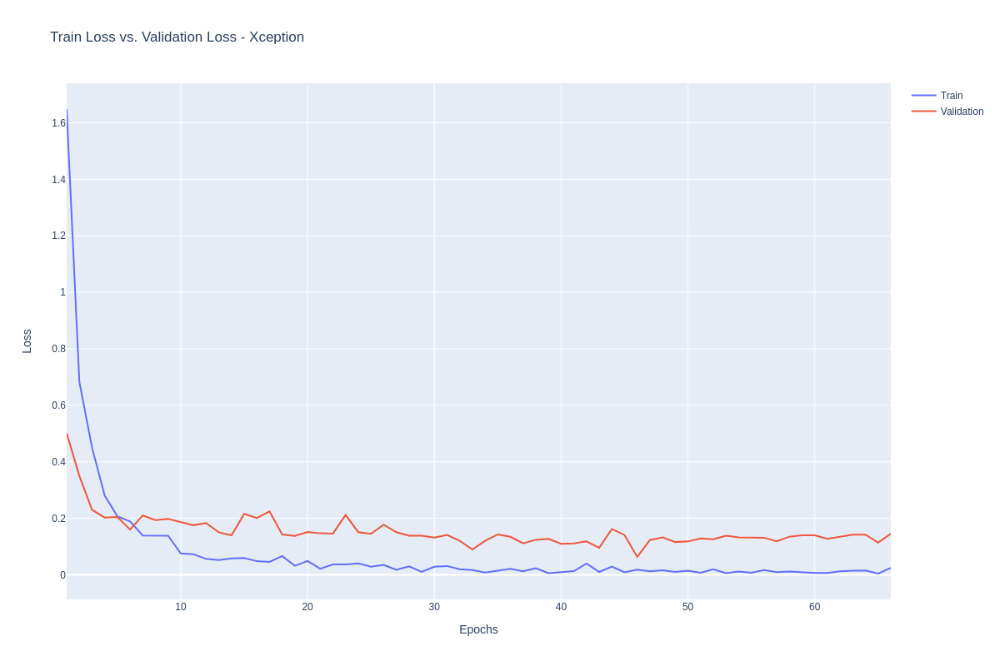
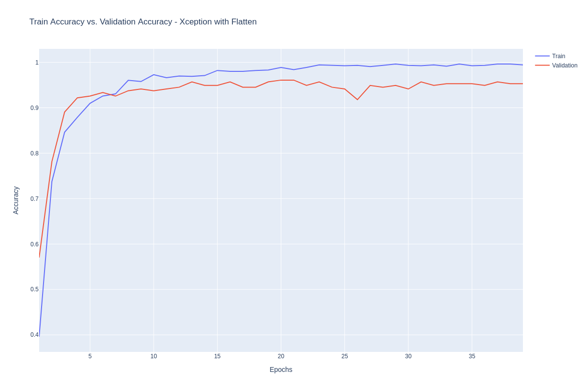
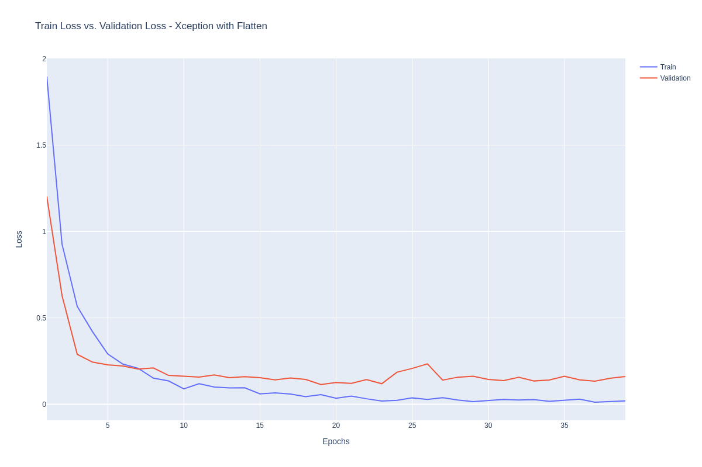

# Monkey-Species-Classification
Using a CNN to classify images of monkeys from a possibility of 10 species

# Species being Classified

These are the 10 different species I will be attempting to classify. Already, I see some potential problems, that being that there are sometimes watermarks in the pictures.

# Neural Networks

Plan to create visual diagrams of the networks used

# Results

## Custom Tensorflow-Keras CNN

The CNN got a perfect score on the train data set on epoch 192, which doesn't matter as the scores on the validation data set flatlined way before that.

The peak for the validation data set was an accuracy of 78% on epoch 175.

Shows signs of the model definitely overfitting. Even though the loss on the training data set is practically 0, the loss continues to slowly increase from epoch 40 to 200.

## Xception with ImageNet Weights

Interesting to see how quickly the model improves in accuracy from the training data set after only a few epochs.

As for the validation, within 5 epochs, the accuracy scores improve by 22% which is very impressive. After that jump, there is another spike around epoch 8 that jumps 6% and just coasts in the 96-98% accuracy range for the rest of the epochs until Early Stopping kicks in.

The loss does not fluctuate much at all, with the exception of some small hills. This means that overall, the model covers a broad spectrum of pictures accurately.

## Xception Model with Flatten

Curious to see what the difference would be

So the scores the models achieve are roughly the same. The only difference is that with flatten, the peak score is hit in ~half the epochs.

Same idea here. Both models achieved the same score, but the model with a flatten laayer right before the output layer achieves these results much quicker.