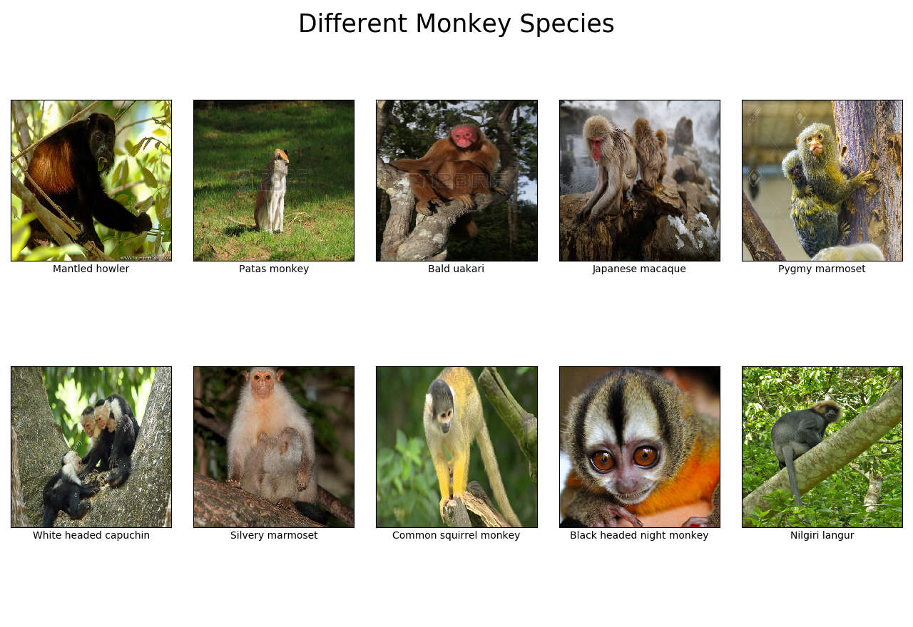

# Monkey-Species-Classification
Using a CNN to classify images of monkeys from a possibility of 10 species

# Species being Classified

These are the 10 different species I will be attempting to classify. Already, I see some potential problems, that being that there are sometimes watermarks in the pictures.